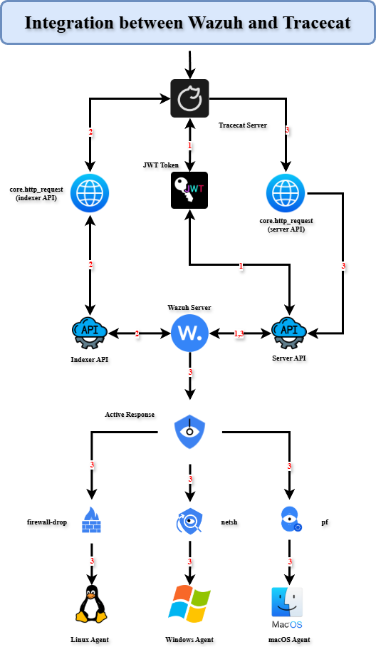

Architecture
============

The integration between **Wazuh** and **Tracecat** is built around API communication and automated active responses.  
The workflow can be broken down into the following core components:

1. **Tracecat Server:** The central automation platform where workflows are defined. Tracecat handles authentication, API calls, and orchestrates active responses.
2. **Authentication (JWT Token):** Tracecat fetches a JWT token from the Wazuh Server API to authenticate further requests. This ensures secure communication between Tracecat and Wazuh.
3. **Log Collection via Indexer API:** The Wazuh Indexer API (default port **9200**) provides access to security event data. Tracecat queries these logs using ``core.http_request`` to detect suspicious activities such as SSH brute-force attempts.
4. **Wazuh Server API:** The Wazuh Server API (default port **55000**) exposes endpoints for agent management and active responses. Once authenticated, Tracecat can issue commands to agents through this API.
5. **Active Response Orchestration:** When a malicious event is detected, Tracecat triggers **Active Response** actions through the Wazuh Server:

   - **Linux agents** → Apply `firewall-drop` rules to block malicious IP addresses.  
   - **Windows agents** → Execute `netsh` commands to enforce blocking.  
   - **macOS agents** → Utilize the `pf` (packet filter) firewall for blocking.

6. **Agent Enforcement**  
   The final stage of the workflow is carried out by the Wazuh Agents (Linux, Windows, or macOS).  
   Each agent executes the instructed active response, effectively neutralizing the detected threat at the endpoint level.

Architecture Diagram
--------------------

Below is the architecture of the Wazuh and Tracecat integration:

