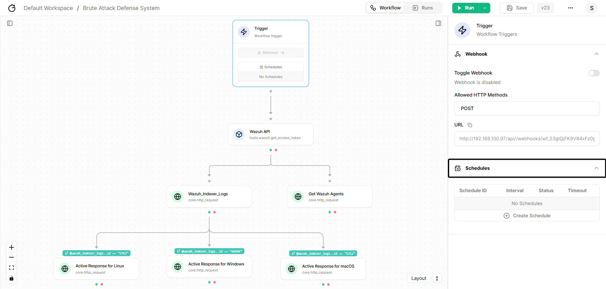

Automated Runs
==============

After coming all this way far, there could be one question that may appear in our minds that,
**"Do we really need to run the workflow manually like this every time?"**

Well hopefully, the answer is **NO!** We can actually set the workflow for scheduled runs, this will help regarding any workflow you create.
Like any other SOAR Tracecat also, has its feature of scheduled workflow runs, where any workflow you set up, will run automatically after a
specified period of time.

Setting Up Scheduled Runs
-------------------------

In order to set up workflow scheduled runs, hit the ``Trigger`` component, and you will find it ``Schedules`` Tab at the last.



.. raw:: html

   <div style="height:25px;"></div>

Next, ``Create Schedule``` and before actually setting it up you will find that, it's divided into ``Years``, ``Months``, ``Days``, ``Hours``, ``Minutes`` and ``Seconds``.
Feel free to set tinker with it and set it up as you like. As for our case, I have set the timer to ``30 Seconds``,
which means the workflow will automatically run every ``30 Seconds`` period.

