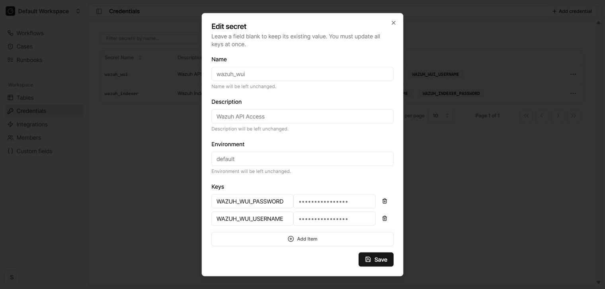

Prerequisite
============

Before getting started, we will be requiring to set some Credentials on our Tracecat Server. On the landing page of your Tracecat Server, 
you will notice the **Credentials** section under Workspace. You need to add the credentials of **`wazuh-wui`** user and
a user that has access to Wazuh's Indexers (e.g. **A Wazuh Admin**). You can obtain it by following the `Quick Start <https://documentation.wazuh.com/current/quickstart.html>`_
section of Wazuh's Official Documentation Page.

Setting up the wazuh-wui Credentials
----------------------------------------

Select **Add Credentials** and set these two parameters exactly as it is and in the exact same order.

1. ``WAZUH_WUI_PASSWORD``: Fill the parameter with the same password of your **wazuh-wui** user.
2. ``WAZUH_WUI_USERNAME``: Fill this parameter with the same name of your **wazuh-wui**, which is **wazuh-wui** itself by default.

.. raw:: html

   

Setting up the Credentials for Wazuh Indexer API Server
-------------------------------------------------------

The user **wazuh-wui** is not authorized to access the Wazuh Indexers. That's why we will be needing a user who has access to it.
The right and most easy choice would be a **Wazuh Admin** itself. Add the credentials in the same way. For the below parameters,
the naming convention and order are not required to be the exact since they are optional and are being added on demand.

1. ``WAZUH_INDEXER_USERNAME``: Fill the parameter with the same username of your Wazuh Admin user.
2. ``WAZUH_INDEXER_PASSWORD``: Fill this parameter with the same password of your Wazuh Admin.

.. image:: ../../assets/images/wazuh-tracecat-integration/tracecat-server-credential-2.png
    :alt: Tracecat Server Credential - Wazuh Indexer User's Credential Setup
    :align: center

.. raw:: html

   

.. tip:: 
    
    Follow the `Quick Start <https://documentation.wazuh.com/current/quickstart.html>`_ hyperlink to know, 
    how to fetch the credentials of **wazuh-wui** and other users in details. Otherwise, you might need to change the password of that users
    in order to have it again. Besides, If you change the **wazuh-wui** password, you must update it in the Wazuh dashboard and
    if you change the **admin** password, you must update it in Filebeat and the Wazuh server. 
    Follow Wazuh's `Password Management <https://documentation.wazuh.com/current/user-manual/user-administration/password-management.html>`_ guide to know more.