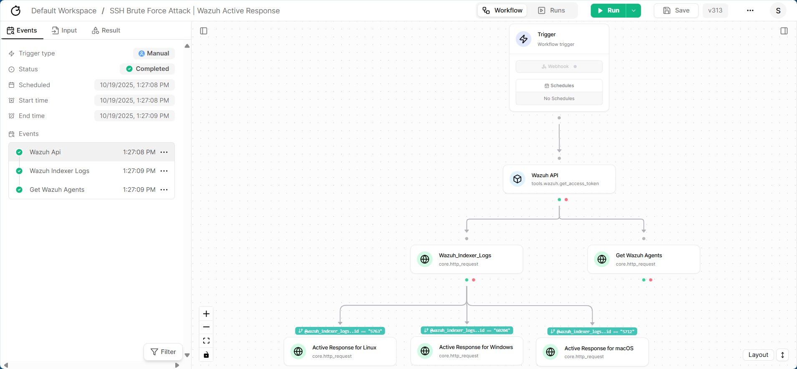

Proof of Concept
================

Alright, now it's time for to test what we have configured so far. We will be using the ``Hydra`` tool for the SSH and RDP Attack.

.. raw:: html

    <h2>Checking the Workflow</h2>

If everything goes alright, without any error we will see something like this, at our Tracecat environment.

.. raw:: html

   

We will find the ``Status`` → **Completed**. You can also verify deeper by digging into the Result tab.

.. toctree::
   :maxdepth: 3
   :hidden:

   ../../projects/wazuh-tracecat-integration/testing-linux-agents
   ../../projects/wazuh-tracecat-integration/testing-windows-agents
   ../../projects/wazuh-tracecat-integration/testing-macos-agents
   ../../projects/wazuh-tracecat-integration/validation

