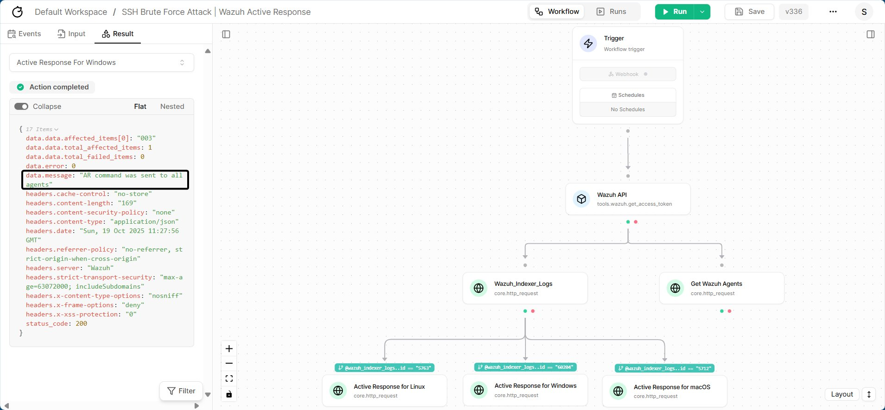
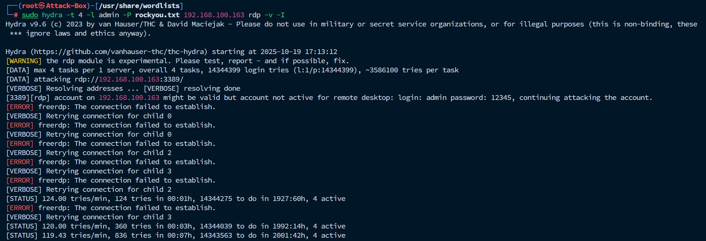

Testing → Windows Agent
=======================

.. note::

    Replace ``[username]``, ``[path/to/wordlist]`` and ``[ip-of-linux-machine]`` according to your preferences.
    You can skip the ``-I`` option if no previous sessions are saved.

Copy and paste the below command on your attacking machine.

.. code-block:: bash

   sudo hydra -t 4 -l [username] -P [path/to/wordlist] [ip-of-linux-machine] rdp -v -I

An image has been attached below for demonstration.

.. image:: ../../assets/images/wazuh-tracecat-integration/tracecat-proof-of-concept-8.png
   :alt: Tracecat Workflow Run, Testing Windows Agents
   :align: center

.. raw:: html

   

Now back to our Wazuh Dashboard, we should be seeing the related logs are being generated. 

.. image:: ../../assets/images/wazuh-tracecat-integration/tracecat-proof-of-concept-9.png
   :alt: Tracecat Workflow Run, Checking Wazuh Dashboard for Windows Agent Test Case
   :align: center

.. raw:: html

   

Now run the workflow that we have created on Tracecat

.. image:: ../../assets/images/wazuh-tracecat-integration/tracecat-proof-of-concept-10.png
   :alt: Tracecat Workflow Run, Windows Agent Test Case Successfully Ran
   :align: center

.. raw:: html

   

You should notice that, the active response component executed. Checking the result section will show further details.

.. raw:: html

   

Checking back on our Wazuh Dashboard, we should notice that an event appeared showing ``Active response: active-response/bin/netsh - add`` on that
specific Agent,as shown in the below image.

.. image:: ../../assets/images/wazuh-tracecat-integration/tracecat-proof-of-concept-12.png
   :alt: Tracecat Workflow Run, Checking Wazuh Dashboard for Active Response Logs of netsh
   :align: center

.. raw:: html

   

Checking on the attacker side, after some time, we will see errors, as shown below.

.. raw:: html

   

This settles that, our setup is functional and working.
