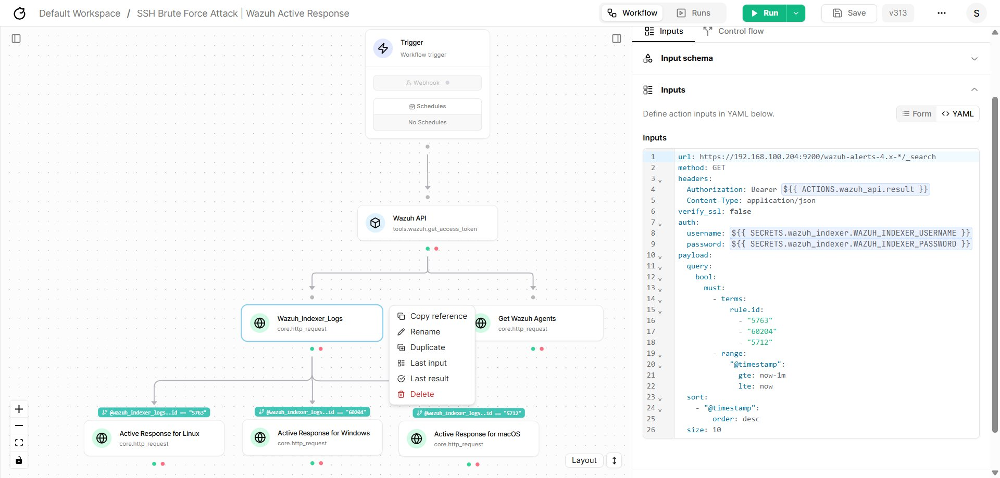
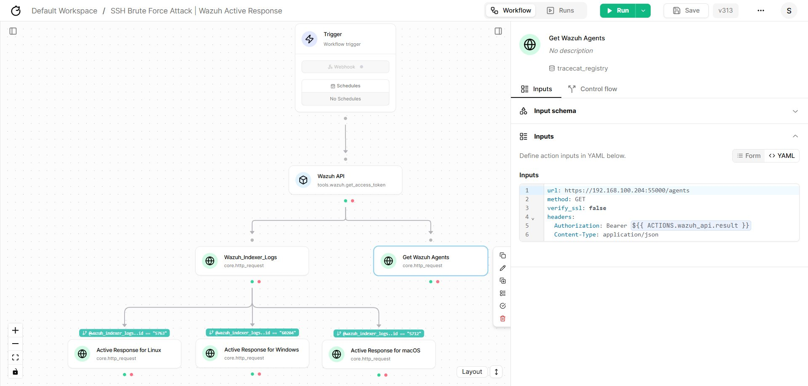
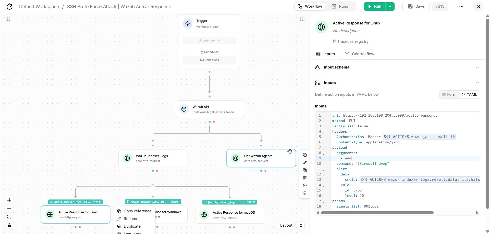
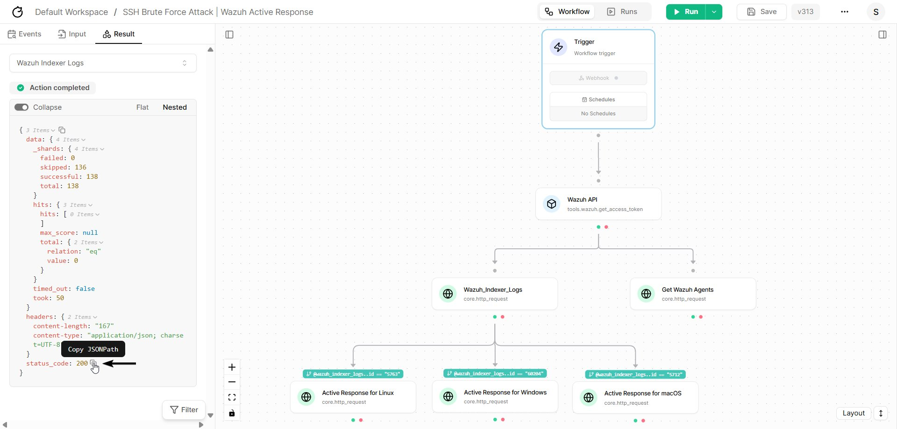

Tracecat Server Components
==========================

Now let's begin configuring the previously mentioned Tracecat components. Rather deep diving into it, 
I will try to simply explain what we are trying to achieve through these components. By selecting each component you will notice an 
input tab asking you to fill up the given required fields. So instead of explaining each field, I will directly focus on its `YAML` configuration to 
explain what we are trying to achieve by setting the parameters.

- **tool.wazuh.get_access_token (Wazuh_API):** Go to the ``YAML`` tab. Copy and paste the below code block:

.. code-block:: yaml

    url: https://[Wazuh_Server_IP]:55000
    verify_ssl: false

The below code just sends a https request to the Wazuh Server API. At backend, the component does its job to fetch the JWT Token.

.. image:: ../../assets/images/wazuh-tracecat-integration/tracecat-server-workflow-contifiguration-1.png
    :alt: Tracecat Server, Wazuh JWT Token Configuration
    :align: center

.. raw:: html

   

- **core.http_request (Wazuh_Indexer_Logs):** Go to the YAML tab. Copy and paste the below code block:

.. code-block:: yaml

    url: https://[Wazuh_Sever_IP]:9200/wazuh-alerts-4.x-*/_search
    method: GET
    headers:
        Authorization: Bearer ${{ ACTIONS.wazuh_api.result }}
        Content-Type: application/json
    verify_ssl: false
    auth:
        username: ${{ SECRETS.wazuh_indexer.WAZUH_INDEXER_USERNAME }}
        password: ${{ SECRETS.wazuh_indexer.WAZUH_INDEXER_PASSWORD }}
    payload:
        query:
            bool:
                must:
                - terms:
                    rule.id: # must be an array argument
                    - "5763"
                    - "60204"
                    - "5712"
                - range:
                    "@timestamp":
                        gte: now-1m
                        lte: now
        sort:
            - "@timestamp":
                order: desc
        size: 10

The above code contacts the Wazuh Indexer API Server with the required Wazuh Indexer credentials that we have set earlier and 
sends a search request to provide data or logs based on ``rule.id 5763, 60204, 5712`` from the last 1 minute. 
And, It will so up to 10 unique sets of data if available. You can set the time, and size according to your convenience.

.. raw:: html

   

- **core.http_request (Wazuh_Server_Logs):** This is an **optional** component in this workflow kept,
    to demonstrate the possibilities you can leverage by accessing the Wazuh Server API. 
    You can visit Wazuh's `Server API Reference <https://documentation.wazuh.com/current/user-manual/api/reference.html>`_
    to know how you can utilize it to the fullest. Go to the ``YAML`` tab. Copy and paste the below code block:

.. code-block:: yaml

    url: https://[Wazuh_Sever_IP]:55000/agents
    method: GET
    verify_ssl: false
    headers:
        Authorization: Bearer ${{ ACTIONS.wazuh_api.result }}
        Content-Type: application/json

The above code contacts the **Wazuh Server API** with collected JWT Token for fetching the list of available agent data on your wazuh server.

.. raw:: html

   

- **core.http_request (Active Response for Linux):** Go to the YAML tab. Copy and paste the below code block:

.. code-block:: yaml

    url: https://[Wazuh_Sever_IP]:55000/active-response
    method: PUT
    verify_ssl: false
    headers:
        Authorization: Bearer ${{ ACTIONS.wazuh_api.result }}
        Content-Type: application/json
    payload:
        arguments: # # must be an array argument
            - add
        command: "!firewall-drop"
        alert:
            data:
                srcip: ${{ ACTIONS.wazuh_indexer_logs.result.data.hits.hits[0]._source.data.srcip }}
            rule:
                id: 5763
                level: 10
    params:
        agents_list: # must be an array argument
            - "001"
            - "002"

The above code contacts the **Wazuh Server API** with collected JWT Token to initiate its active response module to run the ``firewall-drop`` script on 
linux agents. The script has additional arguments such as ``- add, - delete, - [time]`` for blocking the malicious IP for a specific time and more, 
based on the ``rule.id 5763`` and its level of severity. You can also set the list of Linux agents you want the script to run on dynamically or 
statically based on the ``agent.id`` found on your wazuh server.

.. raw:: html

   

- **core.http_request (Active Response for Windows):** Go to the YAML tab. Copy and paste the below code block:

.. code-block:: yaml

    url: https://[Wazuh_Sever_IP]:55000/active-response
    method: PUT
    verify_ssl: false
    headers:
        Authorization: Bearer ${{ ACTIONS.wazuh_api.result }}
        Content-Type: application/json
    payload:
        arguments: # must be an array argument
            - add
        command: "!netsh"
        alert:
            data:
                srcip: ${{ ACTIONS.wazuh_indexer_logs.result.data.hits.hits[0]._source.data.win.eventdata.ipAddress }}
            rule:
                id: 60204
                level: 10
    params:
        agents_list: # must be an array argument
            - "003"

The above code contacts the **Wazuh Server API** with collected JWT Token to initiate its active response module to run
the ``netsh`` script on ``windows`` agents. The script has additional arguments such as ``- add, - delete, - [time]`` for
blocking the malicious IP for a specific time and more based on the ``rule.id 60204`` and its level of severity.
You can also set the list of windows agents you want the script to run on dynamically or statically based on the ``agent.id`` found on your wazuh server.

.. image:: ../../assets/images/wazuh-tracecat-integration/tracecat-server-workflow-contifiguration-5.png
    :alt: Tracecat Server, Wazuh Active Response Configuration for Windows Agents
    :align: center

.. raw:: html

   

- **ore.http_request (Active Response for macOS):** Go to the YAML tab. Copy and paste the below code block:

.. code-block:: yaml

    url: https://[Wazuh_Sever_IP]:55000/active-response
    method: PUT
    verify_ssl: false
    headers:
        Authorization: Bearer ${{ ACTIONS.wazuh_api.result }}
        Content-Type: application/json
    payload:
        arguments: # must be an array argument
            - add
        command: "!pf"
        alert:
            data:
                srcip: ${{ ACTIONS.wazuh_indexer_logs.result.data.hits.hits[0]._source.data.srcip }}
            rule:
                id: 5712
                level: 10
    params:
    agents_list: # must be an array argument
        - "007"

The above code contacts the **Wazuh Server API** with collected JWT Token to initiate its active response module to run
the ``pf`` script on ``macOS`` agents. The script has additional arguments such as ``- add, - delete, - [time]`` for 
blocking the malicious IP for a specific time and more based on the ``rule.id 5712`` and
its level of severity. You can also set the list of macOS agents you want the script to 
run on dynamically or statically based on the ``agent.id`` found on your wazuh server.

.. image:: ../../assets/images/wazuh-tracecat-integration/tracecat-server-workflow-contifiguration-6.png
    :alt: Tracecat Server, Wazuh Active Response Configuration for macOS Agents
    :align: center

.. raw:: html

   

.. tip::
    
    Replace the **`[Wazuh_Sever_IP]`** with your actual Wazuh Sever IP. The default port for the Wazuh Server API is 55000 and the default port for the Wazuh Indexer API is 9200.

.. note::
    Inside the above code blocks you will notice some variables/expressions under ``${{ [JSON_PATH] }}``. 
    hese are basically **JSON_PATHS** found under the **Results** section of your workflow. 
    Just copy the data or parameter value you need and paste it user ``${{ [JSON_PATH] }}`` replacing ``[JSON_PATH]``. 
    This is helpful if you want the parameters of your ``YAML`` configuration to be defined dynamically. 
    An image has been attached for your reference.

.. raw:: html

   

.. warning::
    The JSON paths in the above code blocks are just like variables named after the naming convention of the Title given to each component. 
    For example, **ACTIONS.** ``wazuh_indexer_logs`` **.result.data.hits.hits[0]._source.rule.id**, the quoted red colored area is 
    exactly as the Title set the to the Wazuh_Indexer_Logs core.http_response component.
    
    Blindly copying and pasting the above code blocks might result in workflow execution ``errors``.
    Viewers are advised to work with the comfort oftheir local environmental setup.
    
    The above code blocks are given only for representation purposes. The JSON path might be different from what has been showcased here. 
    That is why images have been given to follow it as a reference.

