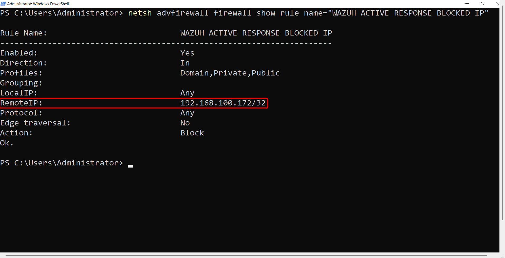

Validation
==========

In this page will see and validate if a malicious attacker or IP is actually blocked.

Linux Agents
------------

To check **Wazuh Active Response -** ``firewall-drop`` script has actually blocked a malicious IP. We need to check ``iptables`` rules list,
as the script leverages ``iptables`` to do its job. Copy and past the command below in your Linux Agent and make sure you have ``sudo`` privileges.

.. code-block:: bash

    sudo iptables -L

You should see ``iptables`` blocked the malicious IP.

.. image:: ../../assets/images/wazuh-tracecat-integration/validation-1.png
   :alt: Validating malicious IP getting Blocked for Linux Agents
   :align: center

.. raw:: html

   

Windows Agents
--------------

To check **Wazuh Active Response -** ``netsh`` script has actually blocked a malicious IP. We need to check ``netsh`` rules list, or
we can check **Windows Defender Firewall** rules through the ``Advanced Settings``. Copy and past the command below in your Windows Agent via ``Command Prompt`` or ``Powrshell`` and
make sure you have ``administrative`` privileges.

.. code-block:: bash

    netsh advfirewall firewall show rule name=all | findstr /i "wazuh"
    netsh advfirewall firewall show rule name="WAZUH ACTIVE RESPONSE BLOCKED IP"

You should be able to see an output like this image below:

.. raw:: html

   

Or, you can also check it via the GUI Interface by simply going to **Windows Defender Firewall → Advanced Settings** and check the ``Inbound Rules`` 

.. image:: ../../assets/images/wazuh-tracecat-integration/validation-3.png
   :alt: Validating malicious IP getting Blocked for Linux Agents
   :align: center

.. raw:: html

   

As you can see, the exact same **Wazuh Rule** name is showing here as well.

macOS Agents
------------

To check **Wazuh Active Response -** ``pf`` script has actually blocked a malicious IP. We need to check ``pf`` rules list,
as the script leverages ``packet filter``, a firewall present by default in macOS devices to do its job.
Copy and past the command below in your Linux Agent and make sure you have ``sudo`` privileges.

.. code-block:: bash

    sudo pfctl -s Tables | grep -i wazuh
    sudo pfctl -t wazuh_fwtable -T show

You should see ``pf`` blocked the malicious IP.

.. image:: ../../assets/images/wazuh-tracecat-integration/validation-4.png
   :alt: Validating malicious IP getting Blocked for Linux Agents
   :align: center

.. raw:: html

   

